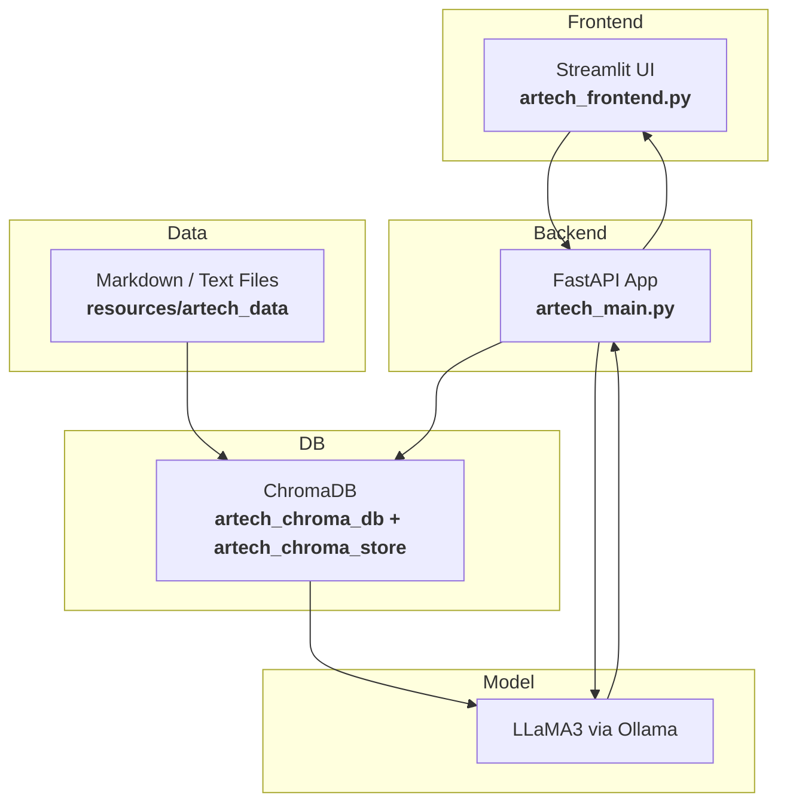

# 🤖 ARTECH Role-Based Chatbot

A secure, intelligent chatbot powered by **LLMs + Vector Search (RAG)** — with **role-based access control (RBAC)** for Finance, HR, Engineering, Marketing, Employees, and Executives.

---

## 🧩 Problem Background

**ARTECH**, a technology-driven enterprise, faced challenges with communication delays and fragmented document access across teams such as Finance, HR, Marketing, Engineering, and Executives. These bottlenecks resulted in slower decision-making and operational inefficiencies due to the lack of a centralized, secure platform for accessing internal knowledge tailored to each role.

---

## 🧠 Solution Overview
To solve this, ARTECH developed an internal AI chatbot leveraging Retrieval Augmented Generation (RAG) and Role-Based Access Control (RBAC). This ensures every user receives accurate, secure, and role-specific information instantly.

This chatbot addresses ARTECH's data access needs using:
- 🧠 **RAG (Retrieval-Augmented Generation)** via LLaMA 3 (Ollama)
- 🔐 **Role-Based Filtering** at the vector search layer
- ⚡ **FastAPI + Streamlit** for interactive chat and authentication
- 🧾 **Documents** organized per department with metadata

---

## 👥 Role-Based Access Control (RBAC)

| Role               | Permissions                                                                 |
|--------------------|-----------------------------------------------------------------------------|
| Executives         | Full unrestricted access to all documents                                   |
| Finance Team       | Financial reports, expenses, reimbursements                                 |
| Marketing Team     | Campaign performance, customer insights, sales data                         |
| HR Team            | Employee handbook, attendance, leave, payroll                               |
| Engineering Dept.  | System architecture, deployment, CI/CD                                      |
| Employees          | General information (FAQs, company policies, events)                        |

---

## 🚀 Features

### 🔐 Secure Role-Based Search
- Each user sees **only** their permitted data
- Executives get **unfiltered** access

### 💬 Interactive Chat Interface
- Built with **Streamlit**
- Login panel with session persistence
- Typing animation + Chat history
- 👍👎 feedback buttons
- Role access transparency shown in every response

### 🔎 Context-Aware Retrieval
- Vector DB powered by **Chroma**
- Embeds `.md` files per department with metadata (`role`, `category`)
- Queries run through vector similarity → LLM → Answer


---

## 🛠 Tech Stack

| Layer         | Tool/Library             |
|---------------|--------------------------|
| Frontend      | Streamlit                |
| Backend       | FastAPI                  |
| Embeddings    | SentenceTransformers     |
| Vector DB     | ChromaDB                 |
| LLM           | LLaMA 3 (via Ollama)     |
| Doc Format    | Markdown (.md)           |

---

## 🧪 Sample Users & Roles

| Username | Password     | Role        |
|----------|--------------|------------|
| Alex     | execpass     | executive  |
| Jamie    | employeepass | employee   |
| Taylor   | engpass123   | engineering|
| Morgan   | marketpass   | marketing  |
| Casey    | finpass789   | finance    |
| Riley    | hrpass456    | hr         |

---

## 🚀 Project Architecture



## 📁 Project Structure

```
ARTECH-RBAC-Chatbot/
├── artech_app/
│   ├── __pycache__/
│   ├── artech_chroma_db/
│   ├── artech_chroma_store/
│   ├── artech_embed_documents.py
│   ├── artech_frontend.py
│   └── artech_main.py
│
├── resources/
│   └── artech_data/
│       ├── engineering/
│       ├── finance/
│       ├── general/
│       ├── hr/
│       └── marketing/
│
├── venv/
│
├── .gitignore
├── .python-version
├── pyproject.toml
├── README.md
└── requirements.txt
```


## ⚙️ Setup Instructions

### 1. Clone the repository

```bash
git clone https://github.com/artech/artech_role_based_chatbot
cd ARTECH-RBAC-Chatbot
```

#### 2. 🔧 Backend Setup (FastAPI + LLaMA 3 via Ollama)

Step into the backend app and create a virtual environment:

```bash
cd artech_app
python -m venv venv
```

Activate the virtual environment:

```bash
venv\Scripts\activate     # On Windows
# OR
source venv/bin/activate  # On Mac/Linux
```

Install the dependencies:

```bash
pip install -r ../requirements.txt
```

In a new terminal, start the LLaMA 3 model using Ollama:

```bash
ollama run llama3
```
📝 Keep this terminal open — it runs the local LLM engine.
The first run will download the model (~3–4 GB).

Go back to the backend terminal and start the FastAPI server:

```bash
uvicorn artech_main:app --reload
```

### 3. 💬 Frontend Setup (Streamlit UI)
In another new terminal:

```bash
cd artech_frontend
streamlit run artech_frontend.py
```
🔗 Visit: http://localhost:8501

### 4. 📄 Embed Documents (Run Once Before Use)
To embed documents into ChromaDB:

```bash
python artech_embed_documents.py
```

This script:
Loads documents from the artech_data/ folder
Generates embeddings using sentence-transformers
Stores them in ChromaDB with role-based metadata

✅ Once these steps are done, your ARTECH role-based chatbot is fully set up and ready to use! 

---

## 🔧 Extending & Customizing

✅ **Add new roles:**  
- Create a new folder in `resources/artech_data/` named after the new department (e.g., `resources/artech_data/legal/`).
- Add your `.md` documents there.
- Update user credentials and roles in your `artech_main.py` or wherever your user-role DB/auth is managed.

✅ **Add new document types:**  
- Extend the file parsing logic inside `artech_app/artech_embed_documents.py` to handle more than `.md` files (like `.pdf`, `.csv`, etc.).

✅ **Change embedding model:**  
- Inside `artech_app/artech_embed_documents.py`, change the line where you set:
  ```python
  EMBEDDING_MODEL = "sentence-transformers/all-MiniLM-L6-v2"
  ```
  to any other `sentence-transformers` model.

✅ **Switch LLM:**  
- Update the `model` name in your FastAPI code (`artech_app/artech_main.py`), where you send the prompt to Ollama:
  ```python
  response = ollama.chat(model="llama3", messages=...)
  ```
  Replace `"llama3"` with another Ollama-supported model (like `"mistral"`, `"codellama"`, etc.).

---

## 📝 License
This project is for internal use at **ARTECH**.  
All source code, models, and documentation are proprietary and confidential.

